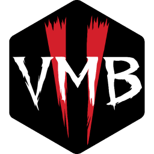

## Vermintide Mod Builder  

A Windows CLI program created to ease the ever-growing pain of creating, building and uploading mods for Vermintide. Works for both Vermintide 1 and 2.    

Made in [Node.js](https://nodejs.org/en/). Compiled with [pkg](https://github.com/zeit/pkg).

### Prerequisites

1. Vermintide Mod SDK must be installed. Look for *"Warhammer: End Times - Vermintide Mod SDK Pre-Alpha"* for Vermintide 1 and *"Warhammer: Vermintide 2 SDK (Alpha)"* for Vermintide 2 in the Tools section in your Steam library.  
4. [V1 ONLY] For now, to enable mods in the launcher, find `launcher.config` in `%AppData%\Fatshark\Warhammer End Times Vermintide` and set `ModsEnabled` to `true`, or add `ModsEnabled = true` if it is missing.  
3. Steam must be running for creating, publishing and uploading mods. 
4. Subscribe to Vermintide Mod Framework on Steam workshop ([V1 version](https://steamcommunity.com/sharedfiles/filedetails/?id=1289946781), [V2 version](https://steamcommunity.com/sharedfiles/filedetails/?id=1369573612)) and make sure that it is the first mod in the list in the launcher if you want VMF-dependent mods to work.

### Quickstart Guide

1. Download and export **[the latest release](https://github.com/Vermintide-Mod-Framework/Vermintide-Mod-Builder/releases)**.  
2. Run vmb.exe to create default .vmbrc config file in the folder with the executable.  
3. Set `game` in .vmbrc to 1 or 2 to determine for which game mods are going to be created, built and uploaded by default.   
4. Run `vmb create <mod_name>` to create a new mod. This will create a new VMF-dependent mod in the `mods` folder from a template and then open a steam workshop page where you will have to subscribe to the mod in order for the game to recognize it.     
5. The main functionality of your mod should be added to `<mod_name>/scripts/mods/<mod_name>/<mod_name>.lua`.  
6. To build the mod, run `vmb build <mod_name>`.  
7. To upload an updated version of your mod, run `vmb upload <mod_name>`.  
8. To re-publish a mod if you deleted it from the workshop, or to publish it for another game, run `vmb publish <mod_name> -g {1|2}`.
You'll need to delete the `published_id` line from the mod's .cfg file when re-publishing.  
9. To submit a mod for sanctioning, follow these steps:
    1. Set `apply_for_sanctioned_status` to true in the mod's .cfg file.
    2. `vmb build mod --source`
    3. `vmb upload mod`

### Usage

	vmb <command> [command-specific params]
	
See **[wiki](https://github.com/Vermintide-Mod-Framework/Vermintide-Mod-Builder/wiki)**.

### Building VMB executable

	npm run setup   
	npm run build

Alongside the executable, a zip archive will be created with template and mods folders included.

### Tests

    npm test
